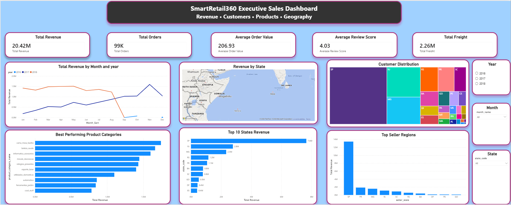

# SmartRetail360 – Retail Analytics Platform

## Project Overview

SmartRetail360 is an end-to-end Retail Analytics Platform built using SQL, Python, Machine Learning, and Power BI.

The project analyzes over 100,000+ retail transactions to uncover customer behavior, sales trends, product performance, and regional insights. The platform follows a real-world analytics workflow including data engineering, exploratory data analysis, machine learning, and executive dashboarding.

---

## Business Problem

Retail businesses generate massive amounts of transactional data every day. Without proper analytics, organizations struggle to:

* Identify high-performing products
* Understand customer purchasing behavior
* Monitor regional sales performance
* Detect sales trends and seasonality
* Make data-driven business decisions

SmartRetail360 addresses these challenges through an integrated analytics solution.

---

## Dataset

Source: Olist Brazilian E-Commerce Dataset

Records Analyzed:

* 100,000+ Orders
* 96,000+ Customers
* Multiple Product Categories
* Regional Sales Data
* Customer Reviews

---

## Technology Stack

### Programming

* Python
* SQL

### Data Analysis

* Pandas
* NumPy

### Visualization

* Power BI
* Matplotlib

### Machine Learning

* Scikit-Learn

### Database

* PostgreSQL

---

## Project Architecture

Raw Data
→ Data Cleaning
→ SQL Data Warehouse
→ Feature Engineering
→ Analytics
→ Machine Learning
→ Power BI Dashboard

---

## Key Features

### Sales Analytics

* Revenue Tracking
* Order Monitoring
* Average Order Value Analysis
* Freight Cost Analysis

### Customer Analytics

* Customer Distribution Analysis
* Regional Customer Insights
* Review Score Analysis

### Product Analytics

* Product Category Performance
* Top Revenue Generating Products

### Geographic Analytics

* State-wise Revenue Analysis
* Seller Distribution Analysis

---

## Executive Dashboard

The dashboard includes:

### KPI Cards

* Total Revenue
* Total Orders
* Average Order Value
* Average Review Score
* Total Freight

### Visualizations

* Revenue Trend Analysis
* Revenue by State Map
* Customer Distribution Treemap
* Top Product Categories
* Top Revenue States
* Top Seller Regions

### Interactive Filters

* Year
* Month
* State

---

## Dashboard Preview

---

## Project Structure

dashboard/
Power BI dashboard (.pbix)

docs/
Project report

images/
Dashboard screenshots

sql/
Database scripts

data/
Raw and processed datasets

reports/
Generated reports

src/
Source code

---

## Business Insights

* Revenue increased significantly during 2017–2018.
* SP generated the highest overall revenue.
* Home and lifestyle categories dominated sales.
* Customer concentration was highest in a few major states.
* Revenue distribution showed strong regional imbalance.

---

## Future Enhancements

* Sales Forecasting
* Customer Segmentation
* Churn Prediction
* Automated Reporting
* Cloud Deployment

---

## Author

Milan Soni

B.Tech Computer Science Engineering

Data Analyst | SQL | Python | Power BI | Machine Learning
