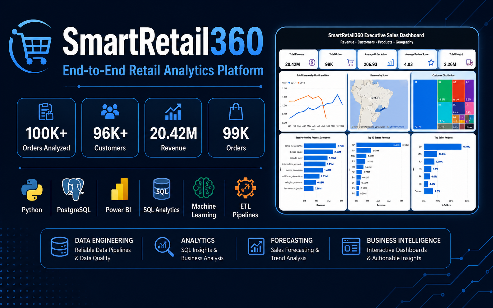
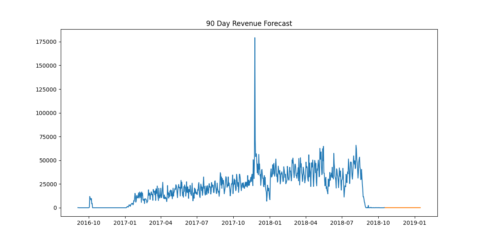

# SmartRetail360 – End-to-End Retail Analytics Platform



## Retail Analytics | Data Engineering | Machine Learning | Power BI

### End-to-End Retail Analytics Platform built using SQL, PostgreSQL, Python, Machine Learning and Power BI

---

# Project Overview

SmartRetail360 is a production-style Retail Analytics Platform designed to transform raw e-commerce transaction data into actionable business insights.

The project analyzes over **100,000+ retail transactions** from the Olist Brazilian E-Commerce Dataset to uncover customer behavior, sales trends, product performance, seller performance, and regional business insights.

The platform follows a complete analytics lifecycle:

* Data Engineering
* Data Warehousing
* SQL Analytics
* Exploratory Data Analysis (EDA)
* Machine Learning
* Business Intelligence
* Executive Dashboarding

---

# Project Deliverables

✅ PostgreSQL Data Warehouse

✅ Star Schema Data Model

✅ ETL Data Pipelines

✅ SQL Analytics & Business Views

✅ Customer Churn Prediction

✅ Sales Forecasting

✅ Power BI Executive Dashboard

✅ Business Insights Report

✅ GitHub Documentation

---

# Business Problem

Retail organizations generate massive volumes of transactional data every day. Without effective analytics, businesses struggle to:

* Identify high-performing products
* Understand customer purchasing behavior
* Monitor regional sales performance
* Detect sales trends and seasonality
* Improve customer retention
* Support data-driven decision making

SmartRetail360 addresses these challenges through a centralized analytics solution.

---

# Dataset

## Source

Olist Brazilian E-Commerce Dataset

Dataset:

https://www.kaggle.com/datasets/olistbr/brazilian-ecommerce

### Records Analyzed

| Metric    | Volume   |
| --------- | -------- |
| Orders    | 100,000+ |
| Customers | 96,000+  |
| Products  | 32,000+  |
| Sellers   | 3,000+   |
| Reviews   | 100,000+ |

---

# Technology Stack

## Programming & Analytics

* Python
* SQL

## Data Analysis

* Pandas
* NumPy

## Machine Learning

* Scikit-Learn

## Data Visualization

* Power BI
* Matplotlib

## Database

* PostgreSQL

## Development Tools

* VS Code
* Git
* GitHub

---

# Solution Architecture

```text
Raw Data
    │
    ▼
Data Cleaning
    │
    ▼
Feature Engineering
    │
    ▼
PostgreSQL Data Warehouse
    │
    ▼
SQL Analytics Layer
    │
    ▼
Machine Learning Models
    │
    ▼
Power BI Executive Dashboard
```

---

# Project Workflow

## Phase 1 – Data Engineering

* Data Extraction
* Data Cleaning
* Missing Value Handling
* Data Transformation
* Feature Engineering
* Data Quality Validation

## Phase 2 – Data Warehouse

* Star Schema Design
* Fact Table Development
* Dimension Table Development
* Index Optimization
* SQL Views Creation
* PostgreSQL Loading

## Phase 3 – Business Analytics

* Revenue Analysis
* Customer Analysis
* Product Analysis
* Seller Analysis
* Regional Analysis

## Phase 4 – Machine Learning

### Customer Churn Prediction

* Customer Feature Engineering
* Classification Modeling
* Churn Risk Scoring

### Sales Forecasting

* Historical Trend Analysis
* Revenue Forecasting
* Future Sales Estimation

## Phase 5 – Business Intelligence

* KPI Monitoring
* Executive Dashboarding
* Interactive Reporting
* Business Insights Generation

---

# Data Warehouse Design

The project follows a Star Schema architecture.

## Fact Table

* retail_fact_sales

## Dimension Tables

* retail_dim_customer
* retail_dim_product
* retail_dim_date
* retail_dim_region
* retail_dim_seller

## SQL Assets

```text
database/schema/
├── 01_create_schema.sql
├── 02_dimension_tables.sql
├── 03_fact_tables.sql
├── 04_indexes.sql
└── 05_views.sql
```

---

# Key Business Insights

## Revenue Performance

* Revenue showed strong growth between 2017 and 2018
* Significant seasonal variations were observed across months
* Revenue concentration existed in a few major states

## Product Performance

* Home and lifestyle categories generated the highest revenue
* Product category performance varied significantly
* Top categories contributed a major share of total sales

## Customer Insights

* Customer distribution was concentrated in key regions
* Purchasing behavior varied across states
* Review scores remained consistently positive

## Regional Performance

* São Paulo (SP) generated the highest overall revenue
* Regional imbalance indicated market concentration
* Seller performance differed significantly by location

---

# Machine Learning Outputs

## Customer Churn Prediction

### Objectives

* Identify customers at risk of churn
* Improve retention efforts
* Support customer targeting strategies

### Outputs

* Customer Churn Scores
* Retention Opportunity Identification
* Customer Risk Segmentation

## Sales Forecasting

### Objectives

* Forecast future sales trends
* Support inventory planning
* Improve business forecasting

### Outputs

* Revenue Forecasting
* Trend Analysis
* Business Planning Support

---

# Executive Dashboard

The Power BI Executive Dashboard provides interactive business insights through KPIs, maps, charts, and filters.

## KPI Cards

| KPI                  | Value  |
| -------------------- | ------ |
| Total Revenue        | 20.42M |
| Total Orders         | 99K    |
| Average Order Value  | 206.93 |
| Average Review Score | 4.03   |
| Total Freight        | 2.26M  |

---

## Dashboard Visualizations

### Revenue Analytics

* Revenue by Month and Year
* Revenue Trend Analysis

### Geographic Analytics

* Revenue by State Map
* Top 10 States Revenue

### Customer Analytics

* Customer Distribution Treemap

### Product Analytics

* Best Performing Product Categories

### Seller Analytics

* Top Seller Regions

---

## Interactive Filters

* Year
* Month
* State

---

# Dashboard Preview


---

# Sales Forecasting

Forecast generated using historical retail sales trends.



---

# Project Structure

```text
SmartRetail360
│
├── dashboard/
│   └── SmartRetail360.pbix
│
├── database/
│   ├── schema/
│   │   ├── 01_create_schema.sql
│   │   ├── 02_dimension_tables.sql
│   │   ├── 03_fact_tables.sql
│   │   ├── 04_indexes.sql
│   │   └── 05_views.sql
│   │
│   ├── indexes/
│   ├── procedures/
│   └── views/
│
├── docs/
│   ├── SmartRetail360 Retail Analytics Platform.docx
│   └── SmartRetail360 Retail Analytics Platform.pdf
│
├── images/
│   ├── banner.png
│   └── executive_dashboard.png
│
├── reports/
│   └── forecast_plot.png
│
├── data/
│
├── src/
│   ├── etl/
│   ├── churn/
│   ├── forecasting/
│   └── analytics/
│
└── README.md
```

---

# Business Impact

* Analyzed 100,000+ retail transactions
* Built a PostgreSQL Star Schema Data Warehouse
* Developed Machine Learning models for churn prediction and sales forecasting
* Created an Executive Power BI Dashboard with interactive filters
* Enabled customer, product, seller, and regional performance analysis
* Supported data-driven business decision making

---

# Future Enhancements

* Advanced Time Series Forecasting
* Customer Lifetime Value (CLV) Modeling
* Real-Time Retail Analytics
* Cloud Deployment (AWS/Azure)
* Automated Data Pipelines

---

# Installation

```bash
git clone https://github.com/Msoni06/SmartRetail360.git

cd SmartRetail360

python -m venv venv

venv\Scripts\activate

pip install -r requirements.txt
```

---

# Author

## Milan Soni

B.Tech Computer Science Engineering

**Data Analyst | SQL | Python | PostgreSQL | Power BI | Machine Learning**

GitHub:
https://github.com/Msoni06

LinkedIn:
https://www.linkedin.com/in/milan-soni-3a69811ab

---

# Project Status

✅ Completed

End-to-End Retail Analytics Platform featuring:

* SQL Data Warehouse
* Data Engineering Pipelines
* Machine Learning Models
* Customer Churn Prediction
* Sales Forecasting
* Power BI Executive Dashboard
* Business Reporting
* GitHub Documentation
